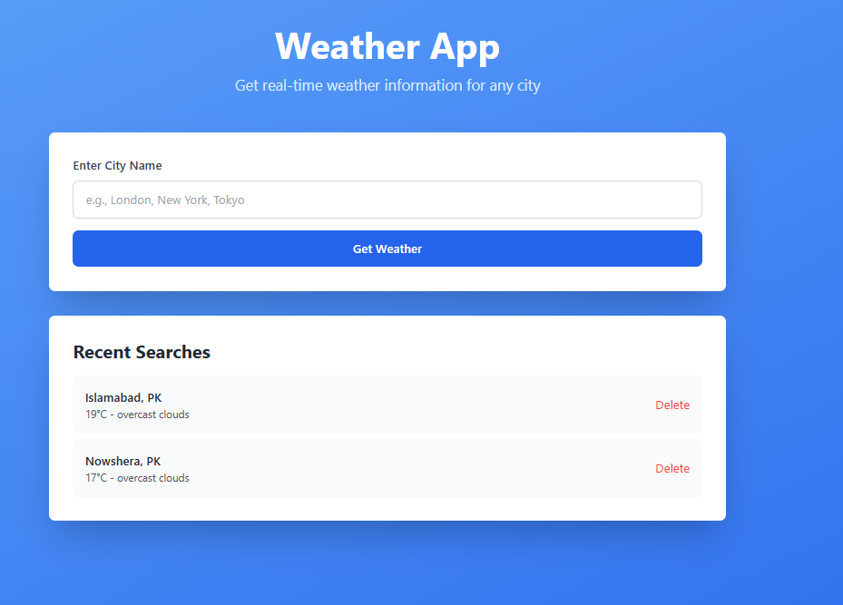
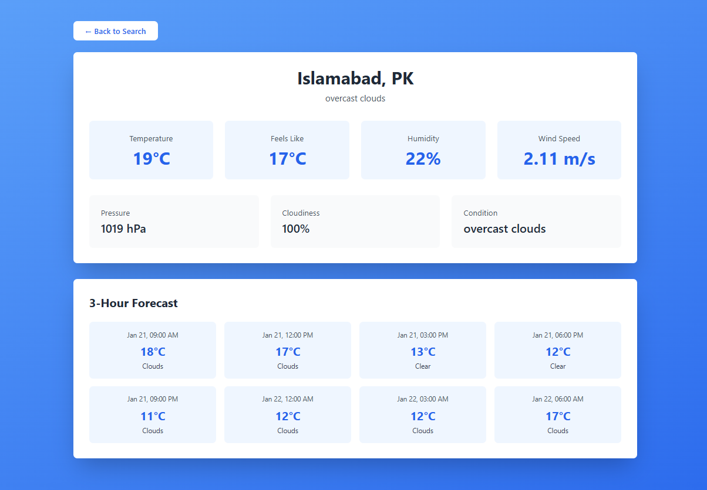
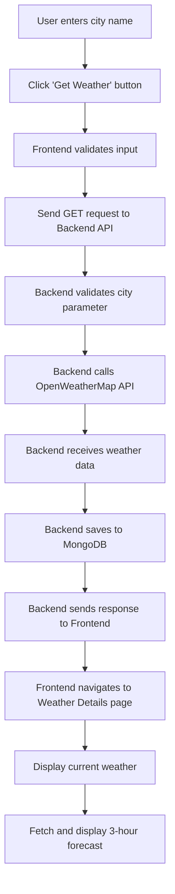

# Weather App - Full Stack Application

<div align="center">


A modern, full-stack weather application built with React (Vite), Node.js, Express, MongoDB, and Tailwind CSS. Get real-time weather information and forecasts for any city worldwide.

[Features](#-features) • [Installation](#-installation) • [Usage](#-usage) • [API](#-api-endpoints) • [Screenshots](#-screenshots)

</div>

---

## 📸 Screenshots

### Home Page

*Home page with search functionality and recent search history*

### Weather Details Page

*Detailed weather information with 3-hour forecast*


## ✨ Features

### Core Features
- 🌍 **Real-time Weather Data** - Get current weather for any city worldwide
- 📊 **Detailed Weather Information** - Temperature, humidity, wind speed, pressure, cloudiness
- 📅 **3-Hour Forecast** - View weather predictions for the next 24 hours
- 🕒 **Search History** - Automatically saves your recent searches (last 10)
- 🔄 **No Duplicate History** - Smart system prevents duplicate city entries
- 🗑️ **Delete History** - Remove individual search history items
- 📱 **Responsive Design** - Works perfectly on desktop, tablet, and mobile devices
- ⚡ **Fast Loading** - Built with Vite for lightning-fast performance

### Technical Features
- RESTful API architecture
- MVC (Model-View-Controller) pattern
- MongoDB database with Mongoose ODM
- CORS enabled for cross-origin requests
- Error handling and validation
- Modern React hooks (useState, useEffect)
- React Router for navigation
- Axios for API requests
- Tailwind CSS for styling

---

## 🛠️ Technology Stack

### Frontend
| Technology | Version | Purpose |
|------------|---------|---------|
| **React** | 18.x | JavaScript library for building user interfaces |
| **Vite** | 5.x | Next-generation frontend build tool |
| **React Router DOM** | v6 | Declarative routing for React |
| **Axios** | Latest | Promise-based HTTP client |
| **Tailwind CSS** | 3.4.17 | Utility-first CSS framework |
| **PostCSS & Autoprefixer** | Latest | CSS processing tools |

### Backend
| Technology | Version | Purpose |
|------------|---------|---------|
| **Node.js** | 14+ | JavaScript runtime environment |
| **Express.js** | Latest | Fast, minimalist web framework |
| **MongoDB** | 4.0+ | NoSQL database |
| **Mongoose** | Latest | MongoDB object modeling |
| **dotenv** | Latest | Environment variable management |
| **CORS** | Latest | Cross-Origin Resource Sharing middleware |
| **Axios** | Latest | HTTP client for API calls |

### External APIs
- **OpenWeatherMap API** - Weather data provider (Free tier: 60 calls/min)

---

## 🏗️ Architecture

This application follows the **MVC (Model-View-Controller)** architecture pattern:

```
┌─────────────────────────────────────────────────────────────────┐
│                         CLIENT SIDE                              │
│  ┌────────────────────────────────────────────────────────────┐ │
│  │  React Frontend (Vite)                                     │ │
│  │  ┌──────────────┐      ┌────────────────────────────────┐ │ │
│  │  │  Home Page   │      │  Weather Details Page          │ │ │
│  │  │  - Search    │      │  - Current Weather             │ │ │
│  │  │  - History   │      │  - 3-Hour Forecast             │ │ │
│  │  └──────────────┘      └────────────────────────────────┘ │ │
│  │                                                            │ │
│  │  ┌──────────────────────────────────────────────────────┐ │ │
│  │  │  API Service Layer (Axios)                           │ │ │
│  │  └──────────────────────────────────────────────────────┘ │ │
│  └────────────────────────────────────────────────────────────┘ │
└─────────────────────────────────────────────────────────────────┘
                            │
                            │ HTTP Requests (REST API)
                            ▼
┌─────────────────────────────────────────────────────────────────┐
│                         SERVER SIDE                              │
│  ┌────────────────────────────────────────────────────────────┐ │
│  │  Express.js Backend                                        │ │
│  │                                                            │ │
│  │  ┌──────────┐    ┌────────────┐    ┌──────────────┐      │ │
│  │  │  Routes  │───▶│ Controller │───▶│    Model     │      │ │
│  │  │  (API)   │    │ (Business  │    │  (MongoDB)   │      │ │
│  │  │          │◀───│   Logic)   │◀───│              │      │ │
│  │  └──────────┘    └────────────┘    └──────────────┘      │ │
│  │                         │                                 │ │
│  │                         ▼                                 │ │
│  │              OpenWeatherMap API                           │ │
│  └────────────────────────────────────────────────────────────┘ │
└─────────────────────────────────────────────────────────────────┘
```

---

## 📁 Project Structure

```
Weather_App/
│
├── Backend/
│   ├── config/
│   │   └── database.js              # MongoDB connection configuration
│   │
│   ├── controllers/
│   │   └── weatherController.js     # Business logic for weather operations
│   │
│   ├── models/
│   │   └── SearchHistory.js         # Mongoose schema for search history
│   │
│   ├── routes/
│   │   └── weatherRoutes.js         # API route definitions
│   │
│   ├── .env                         # Environment variables (create this)
│   ├── .env.example                 # Example environment variables
│   ├── server.js                    # Express server entry point
│   ├── package.json                 # Backend dependencies
│   └── package-lock.json
│
└── frontend/
    ├── src/
    │   ├── pages/
    │   │   ├── Home.jsx             # Home page component
    │   │   └── WeatherDetails.jsx   # Weather details page component
    │   │
    │   ├── services/
    │   │   └── api.js               # API service layer
    │   │
    │   ├── App.jsx                  # Main app component with routing
    │   ├── main.jsx                 # React entry point
    │   └── index.css                # Global styles with Tailwind
    │
    ├── public/                      # Static assets
    ├── index.html                   # HTML entry point
    ├── vite.config.js               # Vite configuration
    ├── tailwind.config.js           # Tailwind CSS configuration
    ├── postcss.config.js            # PostCSS configuration
    ├── package.json                 # Frontend dependencies
    └── package-lock.json
```

---

## 📋 Prerequisites

Before you begin, ensure you have the following installed:

| Software | Minimum Version | Download Link |
|----------|----------------|---------------|
| **Node.js** | v14.0.0 or higher | [Download](https://nodejs.org/) |
| **npm** | v6.0.0 or higher | Comes with Node.js |
| **MongoDB** | v4.0.0 or higher | [Download](https://www.mongodb.com/try/download/community) |

### Additional Requirements
- **OpenWeatherMap API Key** - [Get Free API Key](https://openweathermap.org/api)
  - Sign up for a free account
  - Generate an API key (activation takes 10-15 minutes)


## 🚀 Installation

### 1. Backend Setup

**Backend Dependencies:**
- express
- mongoose
- dotenv
- cors
- axios
- nodemon (dev dependency)

### 2. Frontend Setup

**Frontend Dependencies:**
- react
- react-dom
- react-router-dom
- axios
- tailwindcss
- postcss
- autoprefixer


## 🏃 Running the Application

You need **TWO separate terminal windows** - one for backend, one for frontend.

### Terminal 1: Start Backend Server

```bash
cd Backend
npm run dev
```
**Note:** Backend will run on `http://localhost:5000`

### Terminal 2: Start Frontend Development Server

```bash
cd frontend
npm run dev
```

**Note:** Frontend will run on `http://localhost:5173`

### Access the Application

Open your browser and navigate to:
```
http://localhost:5173
```

---

## 🔌 API Endpoints

### Base URL
```
http://localhost:5000/api
```

### Available Endpoints

| Method | Endpoint | Description | Query Params | Response |
|--------|----------|-------------|--------------|----------|
| GET | `/health` | Check server health | None | `{ status: 'ok' }` |
| GET | `/weather/current` | Get current weather | `city` (required) | Weather data object |
| GET | `/weather/forecast` | Get 5-day forecast | `city` (required) | Forecast array |
| GET | `/weather/history` | Get search history | None | History array (last 10) |
| DELETE | `/weather/history/:id` | Delete history item | `:id` (in URL) | Success message |


## 🔄 Application Flow

### 1. User Searches for Weather



### 2. Search History Management

```
App Loads → Frontend requests history
         ↓
Backend queries MongoDB (last 10, sorted by date)
         ↓
Backend returns history array
         ↓
Frontend displays history items
         ↓
User clicks item → Fetch weather for that city
User clicks delete → Send DELETE request → Remove from DB
```

### 3. Data Flow Diagram

```
┌─────────────┐
│    User     │
└──────┬──────┘
       │ Enters "London"
       ▼
┌─────────────┐
│  Home.jsx   │ (React Component)
└──────┬──────┘
       │ Calls api.getCurrentWeather('London')
       ▼
┌─────────────┐
│   api.js    │ (Service Layer)
└──────┬──────┘
       │ GET /api/weather/current?city=London
       ▼
┌────────────────┐
│ weatherRoutes  │ (Express Router)
└──────┬─────────┘
       │ Routes to controller
       ▼
┌──────────────────────┐
│ weatherController    │ (Business Logic)
└──────┬───────────────┘
       │ 1. Calls OpenWeatherMap API
       │ 2. Saves to MongoDB
       ▼
┌─────────────────┐
│  SearchHistory  │ (Mongoose Model)
│    (MongoDB)    │
└─────────────────┘
```


## 📊 API Rate Limits

### OpenWeatherMap Free Plan Limits:

| Limit Type | Value |
|------------|-------|
| Calls per minute | 60 |
| Calls per month | 1,000,000 |
| Forecast availability | 5-day / 3-hour |
| Data update frequency | 10 minutes |


## 📊 Project Statistics

| Metric | Value |
|--------|-------|
| **Total Lines of Code** | ~1,500+ |
| **React Components** | 2 pages |
| **API Endpoints** | 5 routes |
| **Database Collections** | 1 model |
| **NPM Packages** | 15+ dependencies |
| **Supported Browsers** | All modern browsers |
| **Mobile Responsive** | ✅ Yes |

---

## 🎯 Project Goals

This project was built to demonstrate:

- ✅ Full-stack JavaScript development
- ✅ RESTful API design principles
- ✅ React hooks and modern React patterns
- ✅ MongoDB database integration
- ✅ External API integration
- ✅ Responsive web design
- ✅ MVC architecture pattern
- ✅ Error handling and validation
- ✅ Clean code practices

<div align="center">

### Built with using React, Node.js, MongoDB, and Tailwind CSS

[](https://react.dev/)
[](https://nodejs.org/)
[](https://www.mongodb.com/)
[](https://tailwindcss.com/)


</div>

